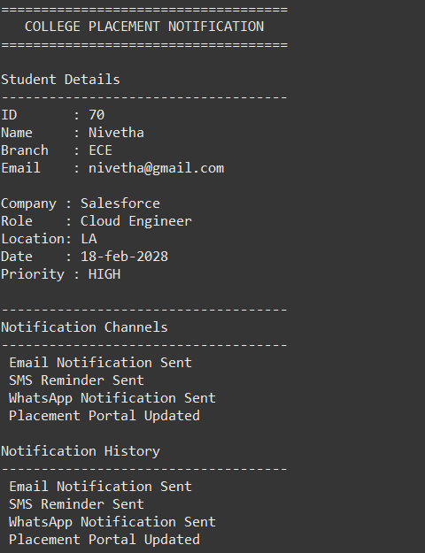

# College Placement Notification System

## Overview

A Java implementation of the Decorator Design Pattern using a College Placement Notification System.

The system allows notification features like Email, SMS, WhatsApp, and Portal updates to be added dynamically without modifying the base notification class.

## Features

- Student placement details management

- Priority-based alerts

- Email notification

- SMS notification

- WhatsApp notification

- Placement portal update

- Notification history tracking

## Design Pattern Used

### Decorator Pattern

The Decorator Pattern allows additional responsibilities to be attached to an object dynamically.

## Technologies

- Java

- Object-Oriented Programming

- Design Patterns

## Output

